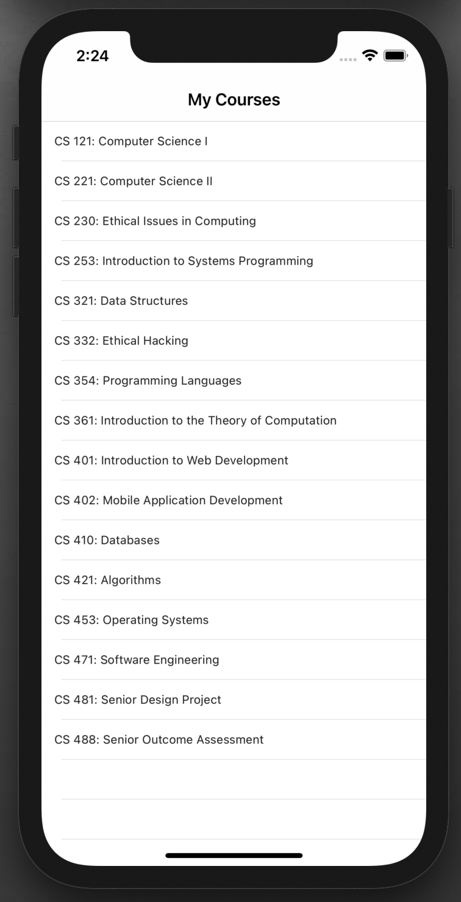
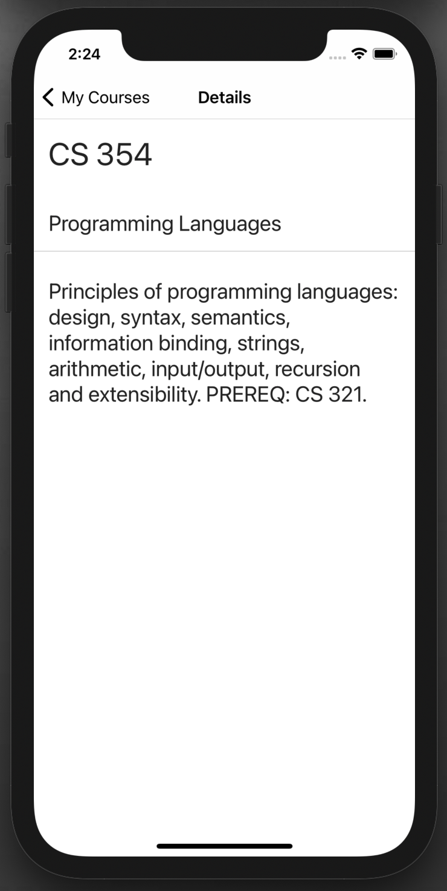

# my-school
A basic NativeScript Application that displays courses I took at Boise State in a master-detail view.

There is the main list view with the course names and you can click on a course to view a more detailed description of the course pulled from the course catalog. 

Here are a few screenshots of what the app looks like!

